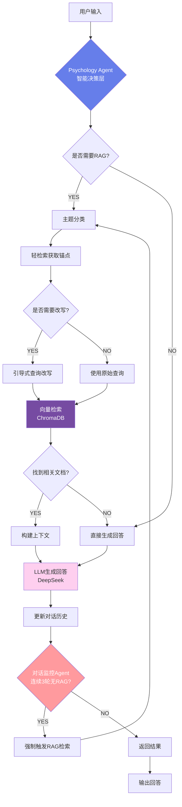
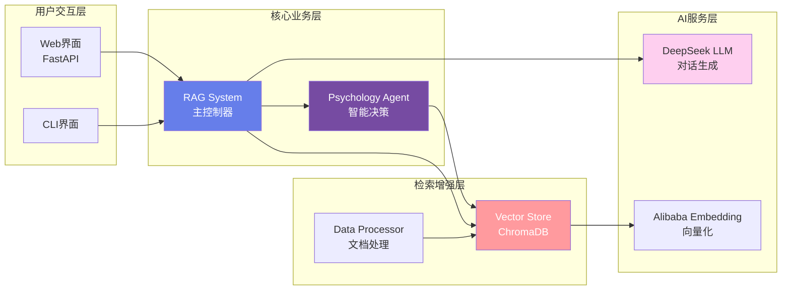

# 心理咨询伴侣 - 系统架构

## 项目类型
**RAG-Augmented Conversational Agent** (RAG增强型对话智能体)

## 核心Pipeline流程图

## 系统架构层次

## 核心组件说明

### 1. Psychology Agent（智能决策层）
- **功能**：智能判断是否需要RAG、主题分类、查询改写
- **特点**：基于LLM的决策能力，动态调整检索策略

### 2. RAG System（主控制器）
- **功能**：整合Agent、向量库、LLM，管理对话流程
- **特点**：对话历史管理、强制检索监控

### 3. Vector Store（检索层）
- **功能**：向量存储、语义检索、主题过滤
- **技术**：ChromaDB + Alibaba Embedding

### 4. Conversation Monitor（对话监控）
- **功能**：追踪连续无RAG轮数，自动触发强制检索
- **阈值**：连续3轮无RAG触发

## 技术栈
- **LLM**: DeepSeek Chat
- **Embedding**: Alibaba Text-Embedding-v4
- **Vector DB**: ChromaDB
- **Web框架**: FastAPI
- **AI理论**: 理情行为疗法 (REBT)

